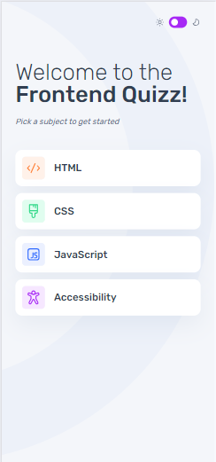
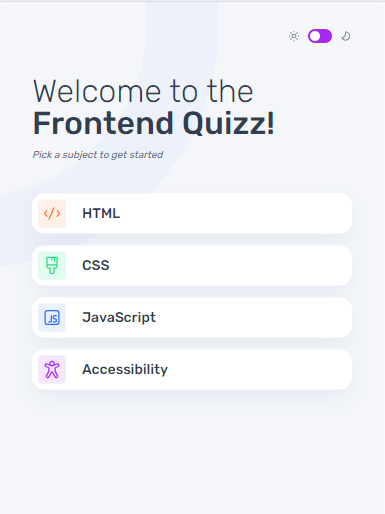
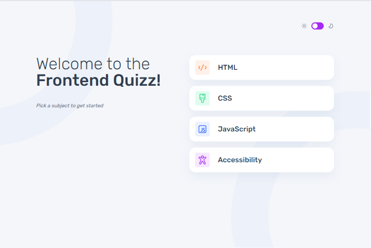

# Frontend Mentor - Frontend quiz app solution

This is a solution to the [Frontend quiz app challenge on Frontend Mentor](https://www.frontendmentor.io/challenges/frontend-quiz-app-BE7xkzXQnU). Frontend Mentor challenges help you improve your coding skills by building realistic projects. 

## Table of contents

- [Overview](#overview)
  - [The challenge](#the-challenge)
  - [Screenshot](#screenshot)
  - [Links](#links)
- [My process](#my-process)
  - [Built with](#built-with)
  - [Continued development](#continued-development)
  - [Useful resources](#useful-resources)
- [Author](#author)
- [Acknowledgments](#acknowledgments)

## Overview

### The challenge

Users should be able to:

- Select a quiz subject
- Select a single answer from each question from a choice of four
- See an error message when trying to submit an answer without making a selection
- See if they have made a correct or incorrect choice when they submit an answer
- Move on to the next question after seeing the question result
- See a completed state with the score after the final question
- Play again to choose another subject
- View the optimal layout for the interface depending on their device's screen size
- See hover and focus states for all interactive elements on the page
- Navigate the entire app only using their keyboard
- **Bonus**: Change the app's theme between light and dark

### Screenshot

### Links

- Solution URL: [Code](https://github.com/JimAxl1/frontend-quizz-app)
- Live Site URL: [Demo](https://frontend-quizz-web-app.web.app/)

## My process

### Built with

- Semantic HTML5 markup
- CSS module
- [Sass](https://sass-lang.com/)
- Flexbox
- CSS Grid
- Mobile-first workflow
- [React](https://reactjs.org/) - JS library
- [React redux](https://react-redux.js.org/)
- [Firebase](https://firebase.google.com/)

### Continued development

I would like to improve in code, be a better developer and learn more tools about frontend.

### Useful resources
This websites helped me to solve some problems during the development, I wrote the problems I had with the development of code in the browser and these were the pages I used the most

- [Stack Overflow](https://stackoverflow.com/)
- [Developer mozilla](https://developer.mozilla.org/)
- [Chat GPT](https://chat.openai.com/)

## Author

- Frontend Mentor - [@JimAxl1](https://www.frontendmentor.io/profile/JimAxl1)
- Github - [@JimAxl1](https://github.com/JimAxl1)

## Acknowledgments

Coffe, people of StackOverflow and ChatGPT